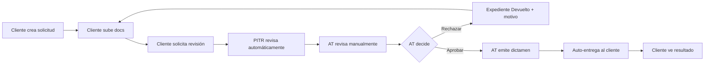

# Plan de Ejecución MVP — Reordenado

**Fecha:** 2026-07-10
**Prioridad del usuario:** ① EP-033 completar UX ② EP-034 Vista Resultado ③ Validación flujo completo ④ EP-031 Pasarela de Pago (diseño existente congelado)

---

## Épica 1: EP-033B — UX de Corrección de Documentación (Cliente)

**Objetivo:** Completar la experiencia de cliente del flujo de correcciones. El backend ya hace la transición `Rechazado → Devuelto → PteDocumentacion` al subir docs, pero el cliente no ve _por qué_ fue rechazado ni tiene una interfaz informativa.

### Gap identificado
- El `CorregirExpedienteButton` muestra "El AT ha solicitado correcciones" pero no muestra el **motivo del rechazo** ni las **observaciones del AT**.
- El expediente en estado `Devuelto` aparece como "Devuelto para correcciones" pero sin detalle del motivo.
- No hay campo `motivo_rechazo` en la tabla `expedientes` que se rellene desde `rechazarExpedienteAT()`.

### Tareas

**T-001: Añadir campo `motivo_rechazo` al expediente**
- Archivo: `src/types/core/expediente.ts` — añadir campo opcional `motivo_rechazo: string | null`
- Migración: Supabase migration para columna `motivo_rechazo text`
- Server Action: `src/lib/actions/at.ts` — en `rechazarExpedienteAT()`, recibir y persistir `motivo_rechazo`
- **Criterio de aceptación:** Cuando un AT rechaza un expediente, el motivo se guarda en DB y se puede recuperar vía `getExpedienteById()`
- **Tests:** Unit test para la server action (rechazar con y sin motivo)
- **Estimación:** 1h

**T-002: Mostrar motivo de rechazo en detalle del expediente (cliente)**
- Archivo: `src/app/(plataforma)/expedientes/[id]/page.tsx`
- Cuando `estado === "Devuelto"`, mostrar el `motivo_rechazo` en una tarjeta informativa (estilo alerta) justo encima del `CorregirExpedienteButton`
- **Criterio de aceptación:** Si el expediente está `Devuelto` y tiene `motivo_rechazo`, se muestra visiblemente. Si no tiene motivo, se muestra un mensaje genérico.
- **Tests:** Ninguno (página server component). Verificar build.
- **Estimación:** 0.5h

**T-003: Validar que el flujo de corrección completo funciona**
- Prueba manual del flujo: AT rechaza con motivo → Cliente ve motivo → Cliente sube docs → Estado pasa a `PteDocumentacion` automáticamente
- **Criterio de aceptación:** El flujo `RevisionManual → Rechazado(motivo) → Devuelto → PteDocumentacion` funciona end-to-end
- **Estimación:** 0.5h

**Total EP-033B:** ~2h

---

## Épica 2: EP-034 — Vista de Resultado para el Cliente

**Objetivo:** El cliente debe poder ver el resultado completo de su expediente una vez está en estado `DictamenEntregado` o `Entregado`, con datos reales del dictamen y el diagnóstico base (sin mocks ni datos de placeholder).

### Gap identificado
- Actualmente `DictamenView` ya se renderiza cuando `estado === "DictamenEntregado"`.
- Sin embargo, el dictamen solo se muestra si existe en `obtenerDictamen()`. Hay que verificar que la integración con datos reales funciona correctamente.
- La página de "mis expedientes" no diferencia visualmente entre estados de completado con resultado visible.

### Tareas

**T-004: Verificar integración de datos reales en DictamenView (cliente)**
- Revisar `src/lib/actions/obtener-dictamen.ts` para confirmar que no usa mocks
- Revisar `src/app/(plataforma)/expedientes/[id]/page.tsx` — la condición actual muestra dictamen solo para `DictamenEmitido` o `DictamenEntregado`, pero el bloque de renderizado en línea 256 solo lo muestra para `DictamenEntregado` (corregir también para `DictamenEmitido` si el AT debe verlo)
- **Criterio de aceptación:** El dictamen se carga desde la BD real y se renderiza completo con todos los campos del diagnóstico base (veredicto, confianza, problemas, actuaciones, análisis económico, coste de inacción)
- **Tests:** Test de integración de `obtenerDictamen()` con datos reales
- **Estimación:** 1h

**T-005: Badge de "Resultado disponible" en lista de expedientes**
- Archivo: `src/app/(plataforma)/mis-expedientes/ExpedientesTable.tsx`
- Añadir estado `Devuelto` al mapping de variantes (warning) y labels
- Añadir indicador visual cuando el expediente está en `DictamenEntregado` o `Entregado` (ej: icono de check verde)
- **Criterio de aceptación:** En la tabla de "Mis Expedientes", los expedientes con resultado disponible muestran indicador claro
- **Estimación:** 0.5h

**T-006: Página dedicada "Ver mi resultado"**
- Crear `src/app/(plataforma)/resultado/[id]/page.tsx` — página simplificada que muestra solo el dictamen, sin la sección de documentos ni carga de archivos
- Incluir CTA "Descargar PDF" (placeholder para V2, mostrar "Próximamente")
- Incluir botón "Volver a mis expedientes"
- **Criterio de aceptación:** El cliente puede acceder a `/plataforma/resultado/[id]` y ver el dictamen completo en formato lectura. Sin opciones de edición.
- **Tests:** Build check, render test
- **Estimación:** 1.5h

**Total EP-034:** ~3h

---

## Épica 3: Validación del Flujo Funcional Completo del MVP

**Objetivo:** Verificar que el flujo completo del MVP funciona end-to-end desde la creación hasta la entrega del resultado, incluyendo correcciones y dictamen.

### Tareas

**T-007: Script de prueba funcional E2E del flujo completo MVP**

- Crear script de test E2E que recorra el flujo completo (usa datos reales de Supabase si es posible, o mocks que simulen cada paso)
- Verificar que las transiciones de estado son válidas según `TRANSICIONES_ESTADO`
- Verificar que no hay estados huérfanos ni transiciones imposibles
- **Criterio de aceptación:** El flujo completo se ejecuta sin errores. Todos los estados y transiciones del workflow CF-028 se cubren.
- **Tests:** Test de integración del flujo completo
- **Estimación:** 2h

**T-008: Auditoría de cierre del MVP (pre-pasarela de pago)**
- Verificar checklist de DEFINITION OF DONE del AGENTS.md:
  - [ ] Implementación completada
  - [ ] Tipos TypeScript actualizados
  - [ ] Tests implementados y pasando
  - [ ] Build completado correctamente
  - [ ] Lint sin errores
  - [ ] Sin TODO ni FIXME
  - [ ] Sin console.log en producción
  - [ ] Auditoría específica completada
  - [ ] Informe de cierre generado
- **Criterio de aceptación:** Todos los puntos del DoD se cumplen. Se genera informe de cierre del MVP.
- **Estimación:** 1h

**Total Validación:** ~3h

---

## Resumen de prioridades

| Prioridad | Épica | Tareas | Esfuerzo total |
|-----------|-------|--------|---------------|
| 1 | EP-033B — UX Corrección | T-001, T-002, T-003 | ~2h |
| 2 | EP-034 — Vista Resultado | T-004, T-005, T-006 | ~3h |
| 3 | Validación flujo completo | T-007, T-008 | ~3h |
| - | **Total MVP (sin pago)** | **8 tareas** | **~8h** |
| 4 | EP-031 — Pasarela Pago | (diseño congelado) | Pendiente |

---

## Plan de pruebas por épica

### EP-033B
| Tarea | Tipo de test | Descripción |
|-------|-------------|-------------|
| T-001 | Unit + Integración | `rechazarExpedienteAT()` guarda motivo; `getExpedienteById()` lo devuelve |
| T-002 | Visual/Build | Verificar renderizado condicional del motivo de rechazo |
| T-003 | Manual E2E | Flujo completo AT rechaza → Cliente ve → Cliente corrige → Revisión |

### EP-034
| Tarea | Tipo de test | Descripción |
|-------|-------------|-------------|
| T-004 | Integración | `obtenerDictamen()` retorna datos reales; no hay mocks |
| T-005 | Visual | Badges correctos en tabla de expedientes |
| T-006 | Build + Render | Página de resultado se renderiza sin errores |

### Validación
| Tarea | Tipo de test | Descripción |
|-------|-------------|-------------|
| T-007 | Integración E2E | Script que recorre todo el flujo MVP |
| T-008 | Auditoría | DoD checklist completo |

---

## Criterios de no-implementación (V2)

- Notificaciones al cliente (email/in-app)
- Histórico de versiones de correcciones
- PDF descargable del dictamen
- Límite de reintentos por expediente
- Documentos de corrección obligatorios vs opcionales
- Firma digital
- Pasarela de pago (diseño existente congelado hasta después de validación)